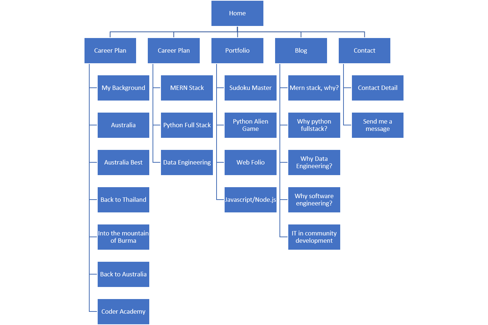
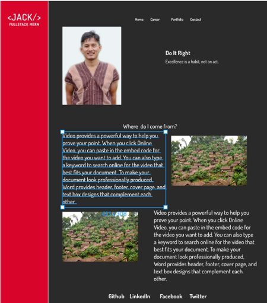
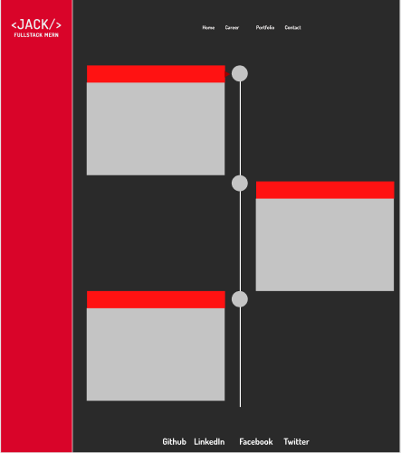
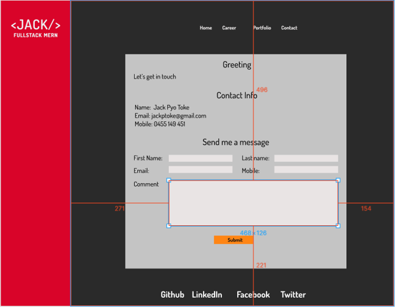
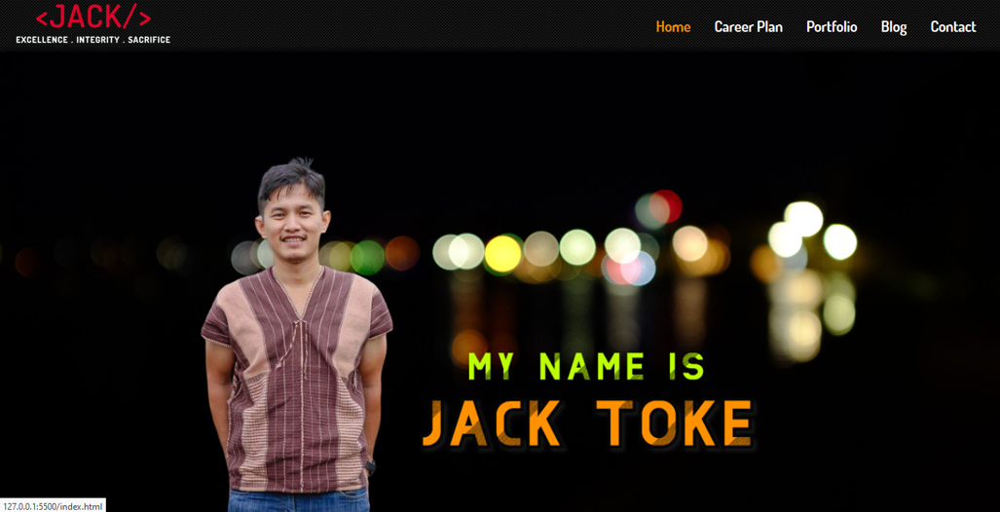
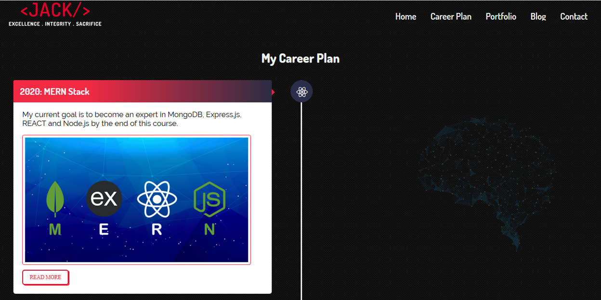
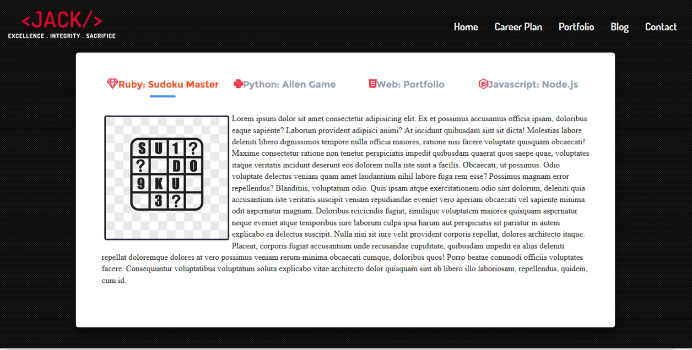
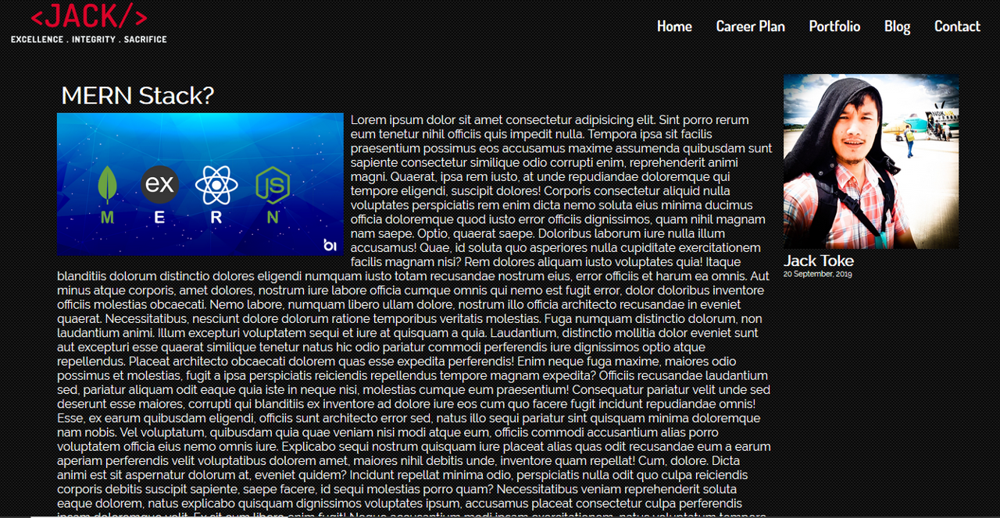
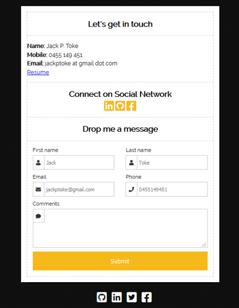

#Jack Toke
## Links
[URL](https://jackptoke.netlify.com)
[GitHub](https://github.com/jackptoke/portfolio)

##Purpose:
There are two purposes of this project.  One is to help me illustrate my ability to use HTML5, CSS and techniques related to them.  Secondly, is to create my personal portfolio that I could further develop to help me for my future employment.

##Functionality/Features
 - CSS, HTML5
 - Parallax scrolling effect
 - Pseudo Elements
    - ::before and ::after
 - CSS Tab
 - Responsive design using media queries
    - Responsive Menu elements using media query
    - Responsive page elements using media query
 - Responsive Blog Page

##Sitemap

##Screenshot
###Prototype
index.html

career.html

Portfolio.html

Contact.html

### Finished Pages
Index.html

Career.html

Portfolio.html

Blog.html

Contact.html

## Differences in protype and finished products
- The absence of left sidebar in the finished product was because as I have further developed the concept, I like the look without the red bar better than with it.
- The menu bar of the finished product doesn't have the red background anymore, because the red background doesn't integrate well with parallax scrolling effect.

##Target Audience
The target audience of this web project are prospect employers or recruiters

##Tech stack
CSS and HTML5

 - Parallax scrolling effect
 - Responsive design using media query
 - Pseudo element of CSS in achieving responsiveness

